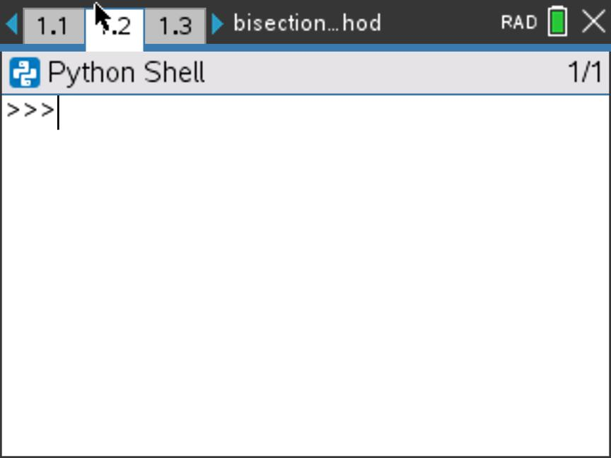

# Bisect Method
A simple python program for the CAS which finds an approximate solution of a graph using the bisection method.

## Requirements
In order to use this program, you must have access to the following resources:

- TI-Nspire CX II CAS <em>(Must be CX II, the standard CX cannot run Python)</em>
- TI-Nspire CX Student Software (if you've lost the key to the bundled program, <a href="https://github.com/lights0123/n-link">n-link</a> should work, too)
- Mini-USB Charging Cable (Comes with the CAS)

## Installation
To directly install to the CAS, do the following:

1. Download this repository
    
    - Scroll to the top of the page and press the green <strong>Code</strong> button
    - Choose "Download as ZIP" from the dropdown that appears, and unzip the folder somewhere you can find it once it's done

2. Open the TI-Nspire Student Software. You should see this screen:

3. Connect your CAS to your computer using the mini-USB cable. A button should show up in the bottom sidebar on the left named after the CAS, under the header "TI-Nspire CX Connected Handhelds"

4. Double click on the button
5. On the upper sidebar, navigate to the directory that you have unzipped the repository to

6. Drag the <strong>bisection_method.tns</strong> from the upper sidebar into the lower one

If a popup has shown up one the screen with the message "Document Received", congratulations! You have successfully downloaded the program

## Using the Program
The .tns file you have just downloaded is split into three pages. These correspond to necessary components for the program:

<strong>1.1</strong> The page containing all of the Python code. You generally won't have to worry about anything on this page

<strong>1.2</strong> The Python "Shell". This page is where you will run and input the program

<strong>1.3</strong> The spreadsheet page. This contains the results from each step of the method, the calculated values will be stored here.

In order to run the program, do the following:

1. Make sure the program is open. The title at the top of the CAS screen should read "bisection_method"

2. Navigate to page <strong>1.1</strong>.

3. Press <strong>Ctrl+R</strong> on the CAS keyboard, or input the following sequence: <strong>Menu</strong> -> <strong>Run</strong> (2) -> <strong>Run</strong> (1)

4. Input the expression of the graph when prompted, pressing Enter when done
    - You must type an asterisk (<strong>*</strong>) between the coefficient and x. This can be accessed by pressing the multiply button on the keyboard
    - In order to signify an exponent, type (<strong>**</strong>) or the carat button (<strong>^</strong>)

5. Type the lower and upper endpoints to search within when prompted
    - It doesn't matter which order you do it in, the program will try both ways

6. If three arrows (<strong>>>></strong>) are printed into the shell without errors, the program has successfully estimated the x-intercept.

7. Navigate to page <strong>1.3</strong>

8. Scroll down to the final row, and check the "c" (third) column. This is your final answer.

